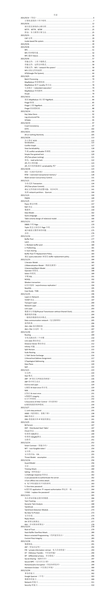

# SE124-CSE-2021-Notes

## 抢先体验版说明

​	最后一节课还没上，请关注本仓库的更新。

## 序言

​	我觉得CSE带给我的不仅仅是技术上的提升，夏老师课上一个个娓娓道来的极客故事让我真正触摸到了开源精神的实质，并且真正努力朝着自己敬仰的那些前辈奋斗。所以决定将这份十万字的笔记分析给大家。如果这份笔记对你有用，请点个Star并且分享给周围的人~

​	一元复始，万象更新。希望这份笔记可以帮到大家，新年快乐！

鲍辰

2021/12/31

## 说明

- 因为在课上记笔记需要高速的图文混排，所以选用的docx作为笔记工具。没有markdown化的计划。
- 因为大部分笔记都是课上所记录，不可避免有疏漏之处，包括上课走神可能遗漏知识点。如果你发现了任何问题，欢迎vx联系我或者提交issue。欢迎你提交自己的补充知识点进来。
- 我想进一步推动软件学院中资料的流通，但我个人很难去以这种质量去维护所有课的笔记。欢迎有愿意分享资料的志愿者同学联系我。
- 任何转载请引用这个仓库。

## 目录

